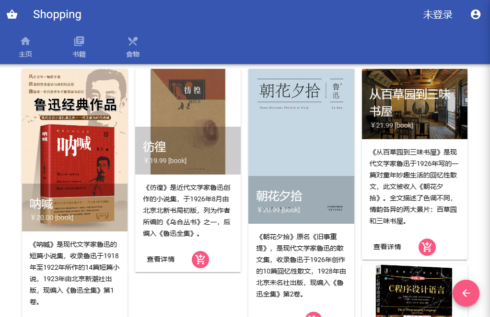
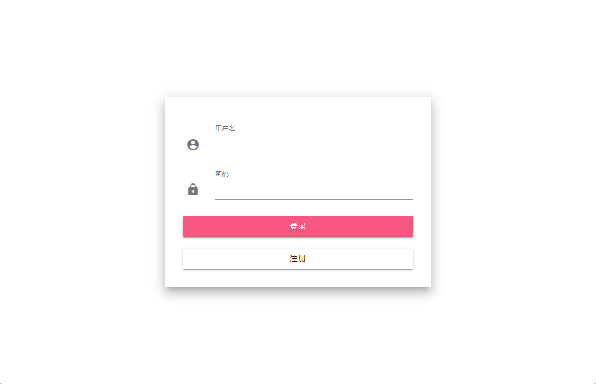
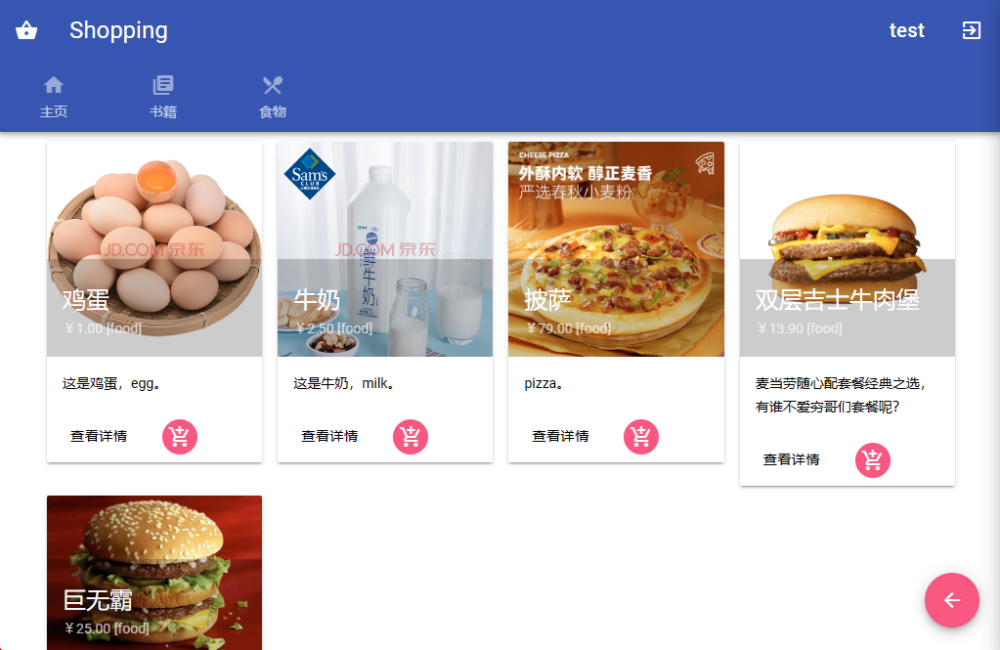
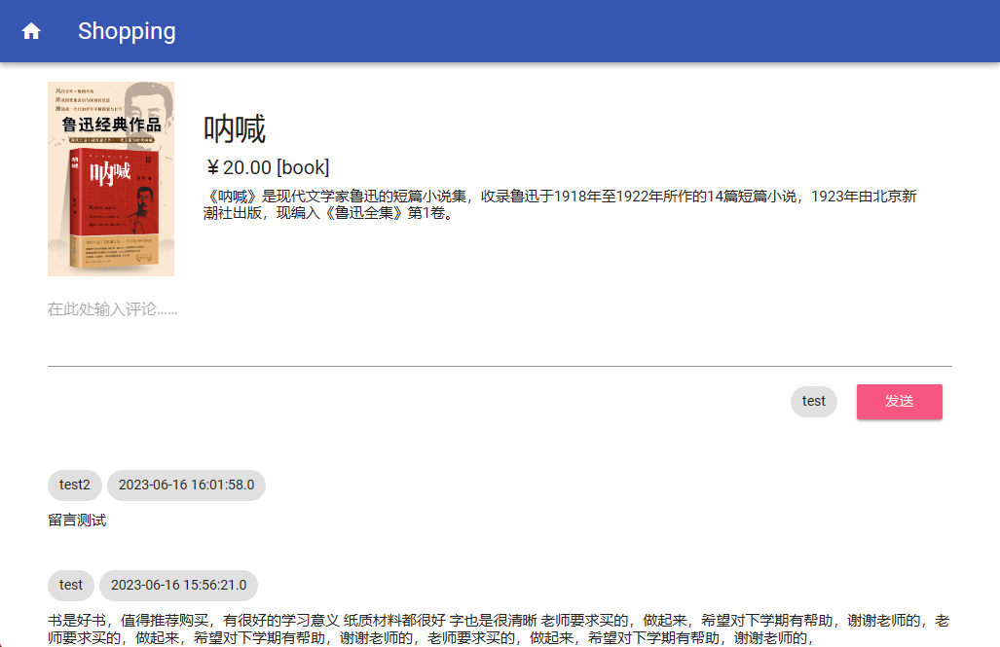
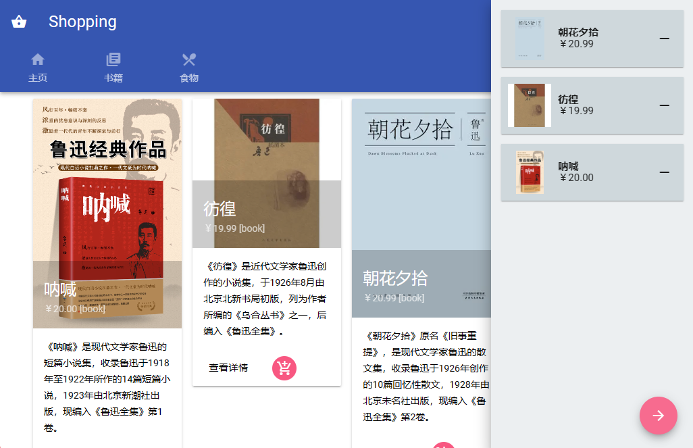

# Shopping

一个 JavaWeb 大作业（（（JSP

使用 [mdui](https://www.mdui.org/) 组件库（部分请求使用 [axios](https://axios-http.com)） 一天速成

## 要求

分组完成，每组3-5人，实现一个简易的购物网站：

1. 可以选购至少两类商品（例如书籍和食品，分别显示在两个购物页面上），每类物品的数量至少为5。

2. 网站中包含一个留言板页面，用户可以进入留言板页面（或者评论区）发表对商品的评论，当用户提交留言后，刷新显示本页。

3. 要求采用数据库连接池的 JavaBean 连接 MySQL 数据库，从表中读取商品信息，连接购物车。

完成形式：

在学习通上提交：

1. 截图：网页及相关功能的截图。
2. 源码：src文件夹、WebContent文件夹以及server.xml文件 + 课堂答辩。

## 截图

### 主页

### 登录

### 按分类查看商品

### 评论

### 购物车

